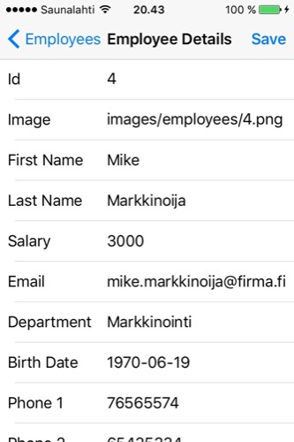

# Company Manager

Kehittyneet ohjelmointikielet -kurssin iOS-osan harjoitustyö

Samuli Tamminen

Työssä on kaikki 40 pisteen työn ominaisuudet.

Lisäksi

- Riippuvuuksien hallinta CocoaPodsin avulla (SwiftyJSON)
- Kuvien cachetus: TableViewControllerin kierrätettävissä soluissa kuvat latautuvat välimuistiin, ja seuraavalla kerralla ne ilmestyvät paljon nopeammin. => Sulavampi scrollaus
- AppIcon
- DatePicker syntymäpäivän valitsemiseen
- DepartmentPicker osaston valitsemiseen

